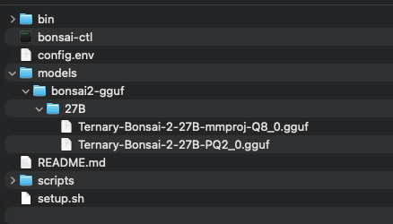

# Bonsai 2 27B — Portable Setup

A self-contained folder for running **Bonsai 2 27B** locally via a
llama.cpp (`llama-server`) OpenAI-compatible background server, and launching
**OpenCode** pointed at it. Copy the whole `portable/` folder to another Mac
and it runs there with no download step.

## Requirements

- **Apple Silicon Mac** (arm64). The bundled `llama-server` and `libggml.*` are
  arm64/Metal binaries only.
- **48 GB+ system RAM** recommended (the default runs full 262,144-token context).
- **opencode** installed (for `bonsai-ctl launch opencode`):
  `curl -fsSL https://opencode.ai/install | bash`, or `brew install opencode`

## What's inside

| Path | What it is |
|---|---|
| `bonsai-ctl` | The control CLI (start/stop/status/launch) |
| `setup.sh` | Creates the `~/.local/bin/bonsai-ctl` symlink. if `~/.local/bin` isn't on your PATH it prints the one line you add yourself. - Also downloads latest binaries for llama-server |
| `config.env` | Server configuration — dot-sourced by `bonsai-ctl` |
| `scripts/` | `start_llama_server.sh`, `common.sh`, `webui-config.json`, `download_binaries.sh` |

## Quick start
```sh
# clone repo and cd into folder
git clone https://github.com/darthcircuit/bonsai-ctl && cd bonsai-ctl

# puts bonsai-ctl on your PATH ./(run in a new shell) and downloads llama-server
./setup.sh
```
Download the Model files from HF: https://huggingface.co/prism-ml/Ternary-Bonsai-2-27B-gguf, and copy them into the created models/bonsai2-gguf/27B folder

When complete, your folder structure should look like this:


---
You can pre-configure and launch OpenCode directly:
```sh
bonsai-ctl launch opencode  # one command: starts the server + opens OpenCode (Bonsai default)
```
Or run the pieces individually:

```sh
bonsai-ctl start           # start the background server (idempotent)
bonsai-ctl status          # print state (exit 0 if up, 1 if down)
bonsai-ctl stats           # tail the llama-server log (live; Ctrl-C to stop)
bonsai-ctl stop            # stop the server
bonsai-ctl help            # usage
```

## Configuration (config.env)

`bonsai-ctl` dot-sources `config.env` at startup: every `KEY=VALUE` line becomes an
exported variable that the server launcher reads. **To change a value, edit the
line in `config.env`.**

| Key | Meaning | Default |
|---|---|---|
| `BONSAI_HOST` | Server bind address (Set to 0.0.0.0 for access outside of localhost) | `127.0.0.1` |
| `PORT` | Server port; opencode's provider points here | `8080` |
| `BONSAI_NGL` | GPU layers offloaded; `0` = CPU-only | `99` |
| `BONSAI_CTX` | Max context tokens; also sets opencode's Bonsai model context | `131072` |
| `BONSAI_VISION` | `1` = load the vision projector → image input in server + opencode; `0` = text-only | `1` |
| `BONSAI_KV4` | `1` = experimental 4-bit (Q4_0) KV cache → ~3.5x less KV RAM (slower decode). Pair with `./scripts/make_kv_bias.sh` for best quality. | `1` |
| `BONSAI_REASONING_BUDGET` | Cap thinking in tokens; `-1` or blank = uncapped | blank |
| `API_KEY` | Shared API key — sent to llama-server and any harness (opencode, future launchers). When set the server enforces it; blank = unauthenticated | blank |
| `BONSAI_OUTPUT` | Optional output token cap (tokens); sent to llama-server (`--n-predict`) and the local Bonsai model's `limit.output`. Left blank, no cap is applied | blank |

## How it works

- **`setup.sh`** creates the symlink `~/.local/bin/bonsai-ctl`. It does **not**
  modify any of your shell rc files. If `~/.local/bin` is not already on your
  PATH, it prints the single line you should add to your rc (you add it
  yourself, then open a new terminal). Idempotent — safe to re-run. Open a **new** shell (or `source ~/.zshrc`) to pick up the new PATH.
- **`bonsai-ctl`** dot-sources `config.env`, then dispatches:
  - `start` — starts the background server via `scripts/start_llama_server.sh`
    (the values from `config.env` are exported into its environment), waits
    for `/health`, and records the PID in `.runtime/server.pid`.
  - `stop` — kills the PID from `.runtime/server.pid` (falls back to the port).
  - `status` — hits `/health`, prints UP/DOWN, exits 0/1.
  - `stats` — tails the llama-server's log (`.runtime/server.log`), which is the
    captured stdout/stderr of the server (that's the portable way to "tail the
    running process"). A short snapshot up front, then follows live (Ctrl-C to
    stop). Works with the server up or just stopped.
  - `launch opencode` - starts the server if needed, then merges the Bonsai
    provider + default model (built as an in-script dict from
    `config.env`: context from `BONSAI_CTX`, output from `BONSAI_OUTPUT`
    when set, key from `API_KEY`) into the **global** opencode config
    `~/.config/opencode/opencode.json`. It reads that file once, merges, and
    writes it back (never clobbers other providers, e.g. oMLX; keeps the
    last pre-change version as `opencode.json.bak.bonsai`). It restarts the
    opencode background service only if that file just changed, then `exec`s
    OpenCode in the directory you invoked it from. No per-project
    `opencode.json` is maintained; the provider lives in the global config,
    so Bonsai is the default. (A project `opencode.json`, if you add one,
    still applies on top, per opencode's precedence.)

  New tools (`hermes`, `pi`, …) go in the `launch_tool` case in `bonsai-ctl`.

## Notes

- This is the **llama.cpp** backend (OpenAI-compatible API).
- opencode's Bonsai provider points at `http://127.0.0.1:<PORT>/v1`, built
  from `config.env` by `bonsai-ctl` on each launch.
- `launch opencode` switches the **global** opencode default model to local
  Bonsai (`~/.config/opencode/opencode.json`, merged, oMLX etc. untouched).
  Existing OpenCode sessions are unaffected; remove Bonsai from the global
  config manually if you want the previous default.
